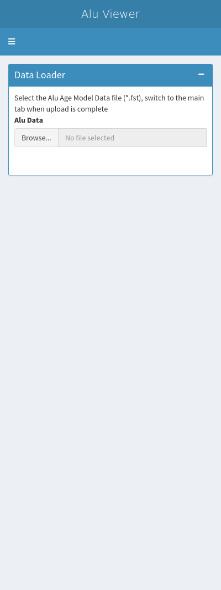

<!-- README.md is generated from README.Rmd. Please edit that file -->

# ShinyAluExplorer

<!-- badges: start -->

<!-- badges: end -->

A Shiny app to explore DNA methylation age models over Alu repeat
elements

## Installation

You can install the development version from
[GitHub](https://github.com/) with:

``` r
# install.packages("devtools")
devtools::install_github("RichardJActon/ShinyAluExplorer")
```

## Loading the App

First load the package then start the App:

``` r
library(ShinyAluExplorer)
#> Loading required package: shiny
#> Loading required package: shinydashboard
#> 
#> Attaching package: 'shinydashboard'
#> The following object is masked from 'package:graphics':
#> 
#>     box
#> Loading required package: ggplot2
#> Loading required package: annotatr
#> Loading required package: dplyr
#> 
#> Attaching package: 'dplyr'
#> The following objects are masked from 'package:stats':
#> 
#>     filter, lag
#> The following objects are masked from 'package:base':
#> 
#>     intersect, setdiff, setequal, union
shinyAluExplorer()
#> 
#> Listening on http://127.0.0.1:3044
```



``` r
## basic example code
```

Then load the Alu age model data inot the app
